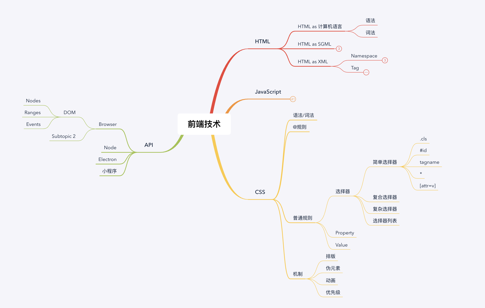

# 学习总结

1. 本周主要是老师对整个知识体系的进行了梳理，按照Winter老师的理解，形成了类似一份老师《重学前端》中的脑图，并进行了进一步的拓充。

2. 进一步对知识体系和标准进行了了解（其实标准整个事情需要花很长时间进行通读和了解），老师教学了相关寻找标准的方法。

3. 自己在开始学习的时候有整理一份知识框架图,同时也希望就是能在边学的过程中不断的去完善，真真正正地是把知识转化称自己的东西，学有所用，不断进化，而不是一蹴而就地照葫芦画瓢，也许只有适合自己的东西才是自己的，取他人所长吧。

原文件 [前端知识树](前端知识树.xmind)

## 参考链接

主要参考网站：

* https://www.ecma-international.org/
* https://developer.mozilla.org/en-US/docs/Web
* https://whatwg.org/
* https://www.w3.org/TR/

* https://tools.ietf.org/html/rfc3986

* https://svn.apache.org/repos/asf/labs/webarch/trunk/uri/rev-2002/issues.html

自己补充了一个ast语法树的尝试的网址

* https://astexplorer.net

* https://www.caniuse.com