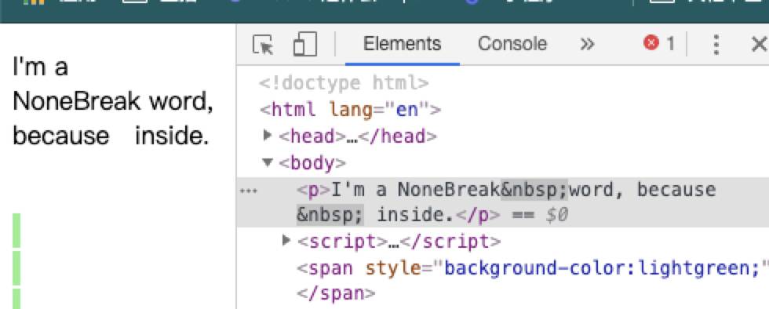

# 二周目总结

## SourceCharacter

1. 字符 Unicode
  
* 常见的ASCII字符部分,注意有一个叫做bell的，响一声

```js
const ASCIIChars = Array.from({ length: 128 }).map((_, index) =>
  String.fromCharCode(index)
);
ASCIIChars.forEach((i) => console.log(i));
```

* 中日韩 CJK 字符

使用中文作为变量名

```js
var 老钱 = "老钱，你好";
console.log(老钱); // 老钱，你好
console.log([..."老钱"].map((i) => i.codePointAt(0).toString(16))); // [ '8001', '94b1' ]

\u8001\u94b1 = 'hello,world';
console.log(老钱)// hello,world
```

* Emoji 及其他

InputElement

* WhiteSpace 空白 [SEPARATOR,SPACE](http://www.fileformat.info/info/unicode/category/Zs/list.htm)  `TAB`、`FF(Form Feed)送纸 \u000C`、`SP 标准空格\u0020`、`NBSP noBreak \u00A0`,`ZWNBSP（Zero Width，也叫BOM,bit order mask） \uFEFF`,`USP`

```js
//制表符 tab
console.log("\t".codePointAt(0));// 9
```

nbsp中的换行表现


```html
<p>I'm a NoBreak&nbsp;word, because &nbsp; inside.</p>
```

* LineTerminator 换行符


* Comment 注释,`//`及`/* */`
* Token 有效指令
  * IdentifierName
    * Keywords 关键字
    * Identifier 变量名 // 0宽字符可以做代码混淆
    * Future reserved 保留字,当前只剩下 enum
  * Punctuator 标点
  * Literal 字符
    * Number
    * String
    * Null
    * Undefined
    * Boolean
    * Symbol

变量名（不允许和关键字重合）
属性名 (允许)

```js
  var get = 3;//get不是关键字
  const obj = {
    get a(){
      return this.b;
    },
    b:'hello,world'
  }
  console.log(obj.a);//hello,world
```

> 注意：undefined 是一个全局变量名，不是关键词; null是关键词，尝试声明var null，直接报错.

```js
var undefined = 10;
console.log(undefined);// undefined 全局作用域无法修改该值
(function(){
  var undefined = 10;
  console.log(undefined); //10 ，局部作用域可以修改
})();
// var null; SyntaxError
```

### Number

IEEE 754


> 0.1+0.2 为什么不等于 0.3
2进制 0b开头:
8进制 0o开头:`0o10 === 8`
16进制 0x开头`0x100===256`

```js
console.log(0b10 === 2);//true
console.log(0o10 === 8);//true
console.log(0x10 === 16);//true
```

parseInt见mdn，第二参数为进制

### String


* Encoding

* Grammer
  * ""  `"\x00","\u00A0","\"","\\","\b","\f|n|r|t"`
  
  * ''
  * ``

## 语言按语法分类

### 非形式语言

中文
  
### 形式语言
  
  1. 0型: 无限制文法 等号左边不止一个 `<a><b> ::= "c"`
  2. 1型: 上下文相关文法 `"a"<b>"c"::="a""x""c"`
  3. 2型: 上下文无关文法 js, 大部分情况是上下文无关
  4. 3型: 正则文法  限制表达能力
  
> 字符相关网址 [FileFormat.info](http://www.fileformat.info/info/unicode/block/index.htm)

整数连加

```any
"+"
<Number>: "0" | "1" ... "9"
<Deciamal>: "0" | (("1" ~ "9") <Number>+)
<Expression>: <Deciamal> ("+" <Deciamal>)+
<Expression>: Deciamal | (<Expression> "+" <Deciamal>)

// 四则运算
<PrimaryExpression> = <DecimalNumber> |
"(" <LogicalExpression> ")" 
<MultiplicativeExpression> = <PrimaryExpression> |
<MultiplicativeExpression> "*" <PrimaryExpression>|
<MultiplicativeExpression> "/" <PrimaryExpression>

<AdditiveExpression> = <MultiplicativeExpression> |
<AdditiveExpression> "+" <MultiplicativeExpression>|
<AdditiveExpression> "-" <MultiplicativeExpression>

// 逻辑判断
<LogicalExpression> = <AdditiveExpression> |
<LogicalExpression> "||" <AdditiveExpression> |
<LogicalExpression> "&&" <AdditiveExpression>

//终结符
如: "+"
// 非终结符:
如:<LogicalExpression>
```

## 图灵完备性

[wiki](https://zh.wikipedia.org/wiki/%E5%9C%96%E9%9D%88%E5%AE%8C%E5%82%99%E6%80%A7)

1. 命令式 -- 图灵机
  
   * goto
   * 能实现if 和 while

2. 声明式 -- lambda

   * 递归
   * 分治

## 类型系统

* 动态静态
* 强类型弱类型
* 复合类型
* 子类型
* 逆变/协变
